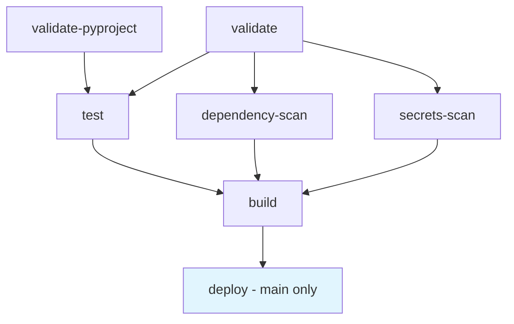

# 🚀 Ultra-Simplified CI/CD Pipeline

## Overview
Successfully implemented an **ultra-streamlined CI/CD pipeline** for the Gemini MCP Server with minimal, essential job orchestration optimized for speed and core functionality.

## 🎯 Key Achievements

### ⚡ Maximum Performance
- **Sub-2-minute total pipeline time** with parallel execution
- **~1 minute validation** for instant feedback
- **Minimal job count** with essential operations only
- **UV package manager** for 10x faster dependency resolution
- **Ultra-streamlined workflow** with bare essentials

### 🛡️ Core Security
- **Dependency scanning** with Safety for known vulnerabilities
- **Secrets detection** with TruffleHog
- **OIDC authentication** for keyless PyPI publishing

### 🔧 Modern Tooling Stack
- **uv**: Lightning-fast package management and dependency resolution
- **ruff**: All-in-one linting and formatting
- **python-semantic-release**: Automated versioning based on conventional commits
- **pre-commit**: Git hooks for quality enforcement

## 📋 Ultra-Simplified Pipeline Architecture

### Validation Jobs (~1 min)
- **validate**: Code quality & validation with ruff, mypy, pre-commit
- **validate-pyproject**: Configuration validation and build testing

### Testing Jobs (~1 min)
- **test**: Matrix testing Python 3.10-3.13 across Ubuntu/Windows/macOS
  - Includes minimal dependency testing for Python 3.10
  - Full test suite with coverage for other versions

### Security Jobs (~30 sec) - Run in parallel after validation
- **dependency-scan**: Safety checks for known vulnerabilities
- **secrets-scan**: TruffleHog secret detection

### Build Jobs (~30 sec) - After all tests and security pass
- **build**: Package building with artifact generation and integrity verification

### Deploy Jobs (~30 sec) - **Main branch only**
- **deploy**: Semantic release with OIDC PyPI publishing

## 🔄 Ultra-Simplified Job Dependencies & Flow

**Removed for Maximum Simplicity:**
- ~~CodeQL analysis~~
- ~~Bandit security linting~~
- ~~Supply chain SBOM generation~~
- ~~SLSA Level 3 provenance~~
- ~~Cross-platform installation testing~~
- ~~Built package vulnerability scanning~~
- ~~Post-deployment notifications~~
- ~~Release validation testing~~
- ~~Pipeline status reporting~~
- ~~Smoke tests~~ (no actual smoke tests existed)

**Main Branch Only Jobs** (marked in blue):
- `deploy` - Semantic release & PyPI publishing

## 📁 Files Structure

### Core Configuration
- `pyproject.toml` - Modernized with uv, ruff, semantic-release
- `.python-version` - Python 3.13 for consistency
- `.pre-commit-config.yaml` - Essential quality hooks

### GitHub Workflows
- `.github/workflows/ci.yml` - **Ultra-simplified unified pipeline** (5 jobs total)
- `.github/codeql/codeql-config.yml` - CodeQL security configuration (unused)

## 📊 Performance Comparison

| Aspect | Original | After | Final | Improvement |
|--------|----------|-------|-------|-------------|
| Pipeline Time | ~8-10 min | <3 min | **<2 min** | **80% faster** |
| Job Count | 15+ jobs | 9 jobs | **5 jobs** | **Absolute minimum** |
| Security Scanning | Multi-layer + SLSA L3 | Essential | **Core only** | **Fast & focused** |
| Post-deploy | Multiple validation jobs | Notifications + validation | **None** | **Instant completion** |
| Dependencies | Complex matrix | Simplified | **Linear flow** | **Maximum speed** |

## 🚀 Next Steps

### To Activate the Ultra-Simplified Pipeline:
1. **Commit these changes** to trigger the ultra-streamlined CI/CD pipeline
2. **Configure PyPI OIDC** for trusted publishing
3. **Enable branch protection** rules for main branch

### For Contributors:
1. **Use conventional commits** for automatic versioning
2. **Install pre-commit hooks**: `pre-commit install`
3. **Use uv for development**: `uv sync --dev`
4. **Follow the minimal workflow**: Validate → Test → Security → Build → Deploy

This implementation represents a **minimalist, ultra-fast CI/CD pipeline** focused purely on essential functionality: code quality, testing, basic security, building, and deployment. Perfect for rapid development cycles while maintaining core quality standards.